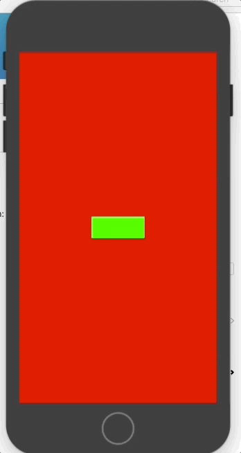

# GCSpriteAlert

Easy to way to make Message or Alert boxes in Spritekit.

&nbsp;&nbsp;&nbsp;&nbsp;

# Introduction
This class is just an SKNode. You add it as you would any other SKNode. There are predefined constants so you can detect which button has been pressed. I made the buttons aligned vertically so that you can put longer button titles if necessary.

#How to Use
Copy GCSpriteAlert.h and GCSpriteAlert.m to your project. Then in your header:

```obj-c
#import "GCSpriteAlert.h";

```

Then in your m file, to call the SpriteAlert:

```obj-c
NSArray *btnArrayTitles = @[@"Cancel",@"Unlock"];
        NSDictionary *dict= [NSDictionary dictionaryWithObjectsAndKeys:
                             @"Locked!",GCSA_KEY_TITLE,
                             @"Unlock all characters by tapping Unlock button below. Your account will be deducted by $10 once. ",GCSA_KEY_MESSAGE,
                             btnArrayTitles, GCSA_KEY_BUTTONTITLES,
                             nil];

        GCSpriteAlert *alert = [[GCSpriteAlert alloc] initWithSize:self.size andParams:dict];
        alert.name = @"Alert1";
        [self addChild:alert];
```

You can name the alert anything you like, then you can detect the button by touchedBegan:

```obj-c

- (void)touchesBegan:(NSSet *)touches withEvent:(UIEvent *)event {

    UITouch *touch = [[touches allObjects] objectAtIndex:0];
    CGPoint location = [touch locationInNode:self];
    SKNode *touchedNode = (SKNode *)[self nodeAtPoint:location];

    if ([touchedNode.name isEqualToString:GCSA_BUTTON_INDEX]) {
        NSNumber *btnIndex = [touchedNode.userData objectForKey:GCSA_BUTTON_INDEX];
        NSLog(@"BTN: %ld",[btnIndex integerValue]);
        GCSpriteAlert *alert = (GCSpriteAlert*)[self childNodeWithName:@"Alert1"];
        [alert dismissAlert];
    }
}

```
